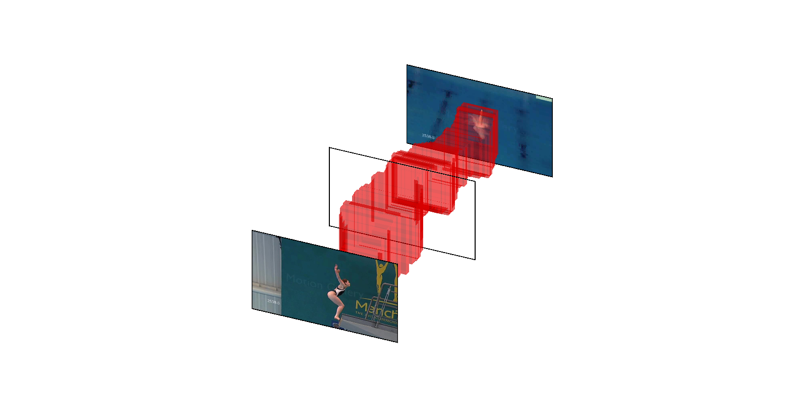

# spatial-aware-object-embeddings
This repository contains the basis for computing spatial-aware object embeddings for zero-shot action localization.

The code is from the paper:
<br>
_"Spatial-Aware Object Embeddings for Zero-Shot Localization and Classification of Actions"_
<br>
Pascal Mettes and Cees G. M. Snoek, International Conference on Computer Vision (ICCV), 2017
<br><br>

<br><br>
The repository includes:
* Object and actor extraction from pre-trained MS-COCO models.
* Scoring of boxes in video frames for specified action names.
* Linking of boxes into zero-shot action tubes.
* word2vec and MS-COCO statistics required for zero-shot action localization and classification.
* Config files, video lists, and train/test splits for common action datasets.

## Running the code

The __first step__ is to adjust the paths for the action dataset of interest in the config file. This can be done either by personalizing the 'framedir' path, or by copying the frames per video to the pre-specified 'framedir' location.

The __second step__ is to extract actor and object instances in each video frame. The code uses Faster R-CNN for such extraction. See their [Github page](https://github.com/rbgirshick/py-faster-rcnn/tree/master/data) for installation.

The code is not limited to a specific model. Throughout the paper we employ a pre-trained Faster R-CNN model based on MS-COCO, which can be downloaded as follows:
```
cd data/
wget https://dl.dropboxusercontent.com/s/cotx0y81zvbbhnt/coco_vgg16_faster_rcnn_final.caffemodel?dl=0
wget https://github.com/rbgirshick/py-faster-rcnn/blob/master/models/coco/VGG16/faster_rcnn_end2end/test.prototxt
cd ..
```

Given the Caffe models, the code for extraction can be run as follows (using UCF Sports as running example):
```
python local_detect.py -c config/ucf-sports.config -p PROTOTXTFILE -m CAFFEMODELFILE
```

The __third step__ is to score individual bounding boxes in video frames. There are multiple parameters here, the default parameters are as in the paper (see help option of the script for details):
```
python local_score.py -c config/ucf-sports.config -t 1
```

The __fourth step__ is to link local box scores into action tubes:
```
python local_link.py -c config/ucf-sports.config -b PATH_FROM_LOCAL_SCORE -s 1 -t 5
```

The local_detect.py, local_score.py, and local_link.py script all have a help option to see the parameters.

## Visualizing action tubes

To facilitate a graphical display of action tubes and to gain quick insight into the correctness of a tube approach, we additionally provide a visualization script for action tubes.

You can run the script directly to yield an example:
```
python visualize_video_tube.py
```
This should give the following result:
<br><br>

<br><br>
For personalized visualizations, please read the script itself.
